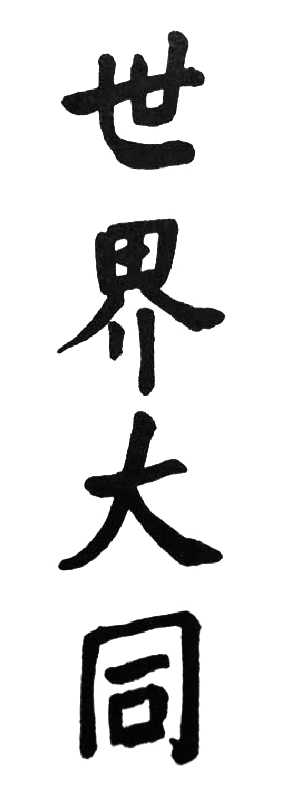

% MO3354 Rethinking the World in East Asia
% Tutor: Konrad M. Lawson
% Fall, 2025

\begin{center}

\textbf{Thursdays 15:00-17:00
\\ St Katharine's Lodge 0.01 - Seminar Room}
\end{center}


<br />  
<br />

```{=latex}
\begin{center}
```



```{=latex}
\end{center}
```

\begin{center}


\textbf{Shijie Datong = The Great Harmony of the World}
\\*Calligraphy by the warlord Yan Xishan for the cover of 世界大同綱要

\end{center}
